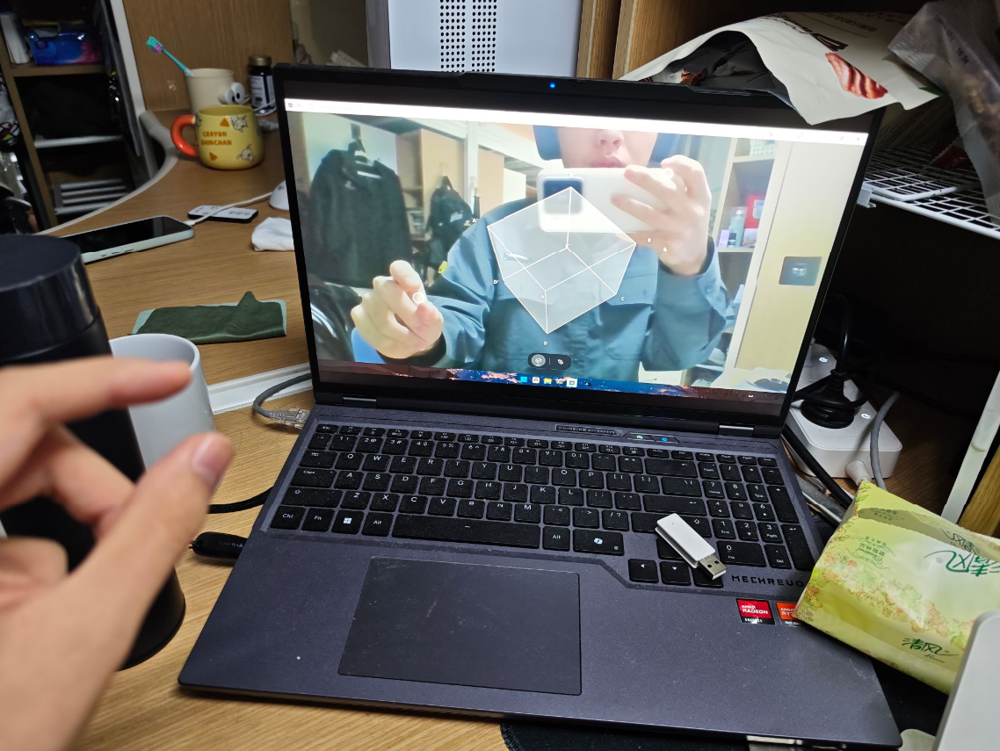
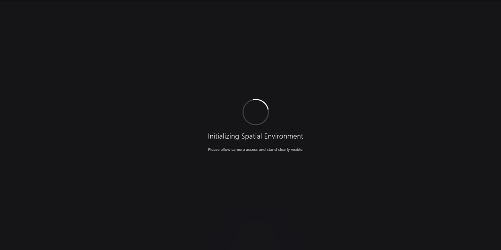
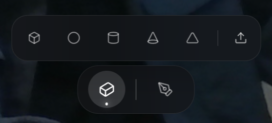
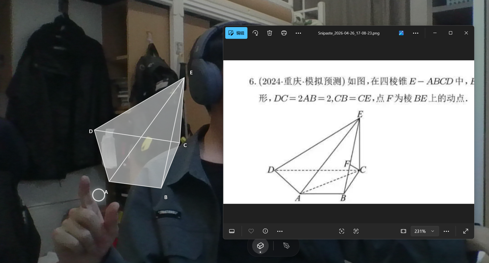
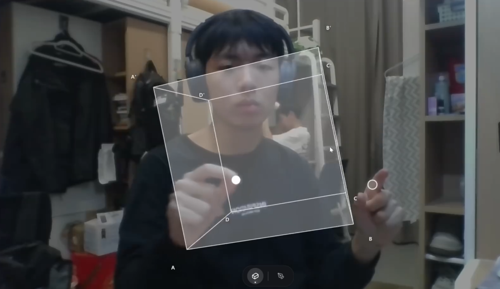
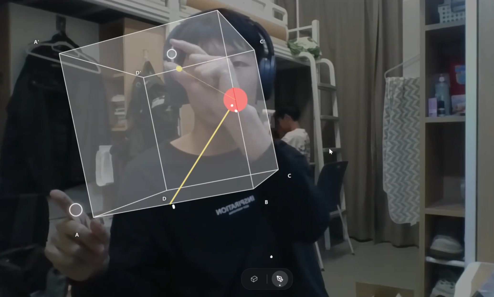
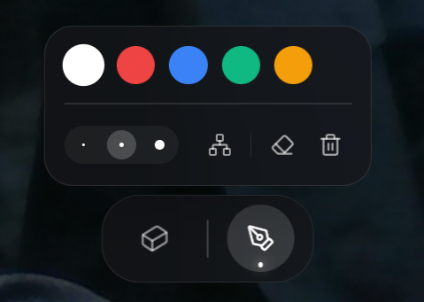

# HoloGrip操作手册

版本号：V1.0

## 一、软件概述

HoloGrip是一款面向数学立体几何教学和演示的交互软件。软件通过摄像头获取实时画面，识别使用者双手的位置和捏合动作，并将手势转换为屏幕光标和操作指令。教师或学生无需佩戴额外设备，即可在画面中选择立方体、球体、圆柱、圆锥、棱锥等三维几何模型，观察模型的边线、顶点标注和空间姿态。

软件的主要使用场景是课堂讲解、几何模型观察和空间关系演示。使用者可以通过手势拖动模型、放大缩小模型、旋转模型，也可以在模型顶点之间建立空间连线，用于说明棱边、对角线、辅助线或空间连接关系。软件还提供屏幕批注功能，使用者可以选择画笔颜色和粗细，在摄像头画面上书写讲解标记。

除预设几何体外，软件支持上传几何图形图片。系统会调用第三方大模型 API 对图片中的立体几何结构进行解析，识别顶点、面和棱边关系，并生成可显示的自定义三维模型。该功能适合在教学中把题目截图或教材图形转化为可旋转观察的空间模型。

图 1 软件主界面与摄像头 AR 画面如下所示。

## 二、运行环境

软件运行时需要可用摄像头，以便识别手部动作。使用前应确认电脑摄像头未被其他程序占用，使用者手部处于摄像头可见范围内，环境光线清晰，背景不要过于复杂。若浏览器或桌面运行环境弹出摄像头授权提示，应选择允许，否则软件无法完成手势识别。

AI 图片解析功能需要配置可用的第三方大模型 API 服务。若未配置 API 密钥，预设几何模型、手势交互和批注功能仍可使用，但上传图片生成自定义模型功能可能无法完成解析。

推荐运行平台为 Windows 10/11 64 位系统。软件可通过开发环境运行，也可通过 Tauri 桌面端封装后以桌面窗口方式运行。开发调试时通常先安装 Node.js 依赖，再启动本地服务；桌面端运行时由软件窗口加载前端界面。

图 2 软件启动初始化界面如下所示。

## 三、进入软件

使用者启动软件后，界面会显示初始化状态。此时系统会加载手势识别模型并请求摄像头权限。授权后，摄像头画面会作为背景显示，界面底部出现工具入口。使用者将手放入摄像头可见范围后，屏幕上会出现对应的手势光标。

手势光标会跟随手部移动。使用者做出拇指和食指靠近的捏合动作时，软件会将其识别为点击或绘制动作。若手势光标没有显示，应检查摄像头权限、手部是否遮挡、光线是否过暗，并重新调整手部位置。

进入软件后的基本操作流程为：先允许摄像头访问，等待初始化完成；再通过底部工具栏选择模型或画笔功能；需要演示几何体时打开模型面板，需要书写讲解标记时打开画笔面板；讲解结束后可以清除批注和连线，重新选择模型继续演示。

图 3 软件进入后的模型选择工具栏如下所示。

## 四、几何模型选择与展示

使用者点击底部的三维模型入口后，软件会展开模型选择面板。面板中包含立方体、球体、圆柱、圆锥和棱锥等常见立体几何体。选择某一模型后，三维几何体会显示在画面中央，模型采用半透明效果，并显示边线和必要的顶点字母标注。

立方体会显示底面和顶面的顶点标注，便于讲解相对顶点、棱和空间对角线。圆柱和圆锥会显示上下底面中心或顶点位置，便于说明轴线、高和底面关系。球体主要用于展示球心位置。棱锥模型可用于说明顶点到底面、侧棱和侧面的空间关系。

再次点击已选中的模型，可以取消当前模型显示。切换到其他模型时，软件会重置模型位置、旋转角度和比例，使新模型以稳定状态出现在画面中，便于重新开始演示。

图 4 预设几何模型选择面板如下所示。

## 五、AI 图片生成自定义模型

使用者在模型面板中点击上传按钮，可以选择本地几何图形图片。图片通常来自题目截图、教材图形或教师准备的几何图。上传后，软件会读取图片内容，并调用第三方大模型 API 解析图形中的几何体类型、顶点、面和棱边关系。

解析过程中，界面会显示分析提示，表示系统正在识别几何结构。解析完成后，软件会把返回的顶点坐标、面数据和边数据归一化处理，生成一个可渲染的三维模型，并加入自定义模型列表。使用者可以点击该自定义模型查看生成效果，也可以删除不需要的模型。

若解析失败，软件会提示错误信息。常见原因包括图片内容不清晰、图形结构过于复杂、API 服务不可用或网络连接异常。使用者可更换清晰图片、检查 API 配置后重新上传。

图 5 上传几何图片并生成自定义三维模型的对比效果如下所示。

## 六、手势操作三维模型

模型显示后，使用者可以通过手势调整模型位置和观察角度。单手捏合并移动时，软件会尝试抓取当前模型并跟随手势移动，适合把模型放到画面中更便于讲解的位置。松开捏合动作后，模型停留在当前位置。

双手同时捏合时，软件会根据双手之间的距离变化调整模型大小。双手距离变大，模型放大；双手距离变小，模型缩小。双手连线的角度变化会带动模型旋转，双手中心点移动也会影响模型的空间姿态。通过这种方式，使用者可以从不同方向观察几何体的边、面、顶点和空间关系。

操作时建议将双手保持在摄像头可见范围内，动作不要过快。若模型移动或旋转不稳定，可以松开手势后重新捏合操作。对于课堂讲解，建议先选择模型并调整到合适角度，再进行顶点连线或屏幕批注。

图 6 用户在摄像头前裸手操作三维模型的实景如下所示。

## 七、顶点连线与线段删除

软件提供三维顶点连线功能，用于在模型顶点之间建立讲解线段。使用者打开画笔面板后，点击三维连线按钮进入连线模式。此时右手光标靠近模型顶点或边上的吸附点时，界面会显示高亮提示。

使用者捏合一次选择起点，再移动到另一个顶点并再次捏合，即可生成一条空间线段。该线段会叠加在三维模型上，可用于讲解空间对角线、辅助线、截面关系或顶点间连接。若起点已选择但需要取消，可以切换工具或重新选择模型状态。

需要删除线段时，使用者切换到橡皮工具，将光标移到已有线段附近。线段被识别后会出现高亮状态。第一次捏合可选中线段，第二次捏合可删除该线段。若需要清除全部线段，可使用清空按钮，同时清除画布批注和模型连线。

图 7 空间画笔绘制辅助线和顶点连线效果如下所示。

## 八、二维批注绘制与擦除

使用者点击底部画笔入口后，软件会展开画笔设置面板。面板中提供白色、红色、蓝色、绿色、黄色等颜色选项，并提供不同粗细的笔触。选择颜色后，使用者用右手捏合并移动，即可在屏幕画面上绘制批注。

绘制内容位于摄像头画面和三维模型之上，适合在讲解时标记关键点、圈出重要区域或写出简单说明。软件会对手势轨迹进行平滑处理，使线条更连贯。捏合程度越明显，笔触可能表现得更粗，便于形成自然的书写反馈。

需要擦除时，使用者点击橡皮工具，再用右手捏合划过已有笔迹。需要重新开始讲解时，可以点击清空按钮，软件会清除当前画布批注，同时清除已建立的三维连线。清空操作不会删除预设模型或已生成的自定义模型。

图 8 画笔批注工具面板如下所示。

## 九、注意事项

使用过程中应保持摄像头画面清晰，避免手部离摄像头过近或过远。若双手同时操作时识别不稳定，可以先单手完成模型选择，再双手进行缩放和旋转。课堂演示前建议提前测试摄像头、API 服务和模型选择功能，确保讲解时能够顺利运行。

上传几何图片时，应尽量选择线条清楚、顶点标注完整、无遮挡的图片。若图片中包含大量辅助线、动态点或题目文字，AI 解析结果可能与预期不同，使用者可重新上传更清晰的几何图，或改用预设模型进行讲解。

软件生成的批注和连线用于当前讲解过程，清空后不再保留。若需要保存课堂演示结果，可通过外部截图或录屏方式记录画面。
